# 简介

知乎：[山与水你和我](https://www.zhihu.com/people/fluence2crane)


个人代码仓库之一， 以传统图像处理和相关算法为主（浅尝辄止），主要语言 C++，日后有空会陆续更新一些经典、有趣的算法。

涉及以下内容：

- [colorization](https://github.com/hermosayhl/image_processing/tree/main/colorization)：        着色
- [compression](https://github.com/hermosayhl/image_processing/tree/main/compression)：      图像压缩
- [deblur](https://github.com/hermosayhl/image_processing/tree/main/deblur)：                 去模糊
- [dehaze](https://github.com/hermosayhl/image_processing/tree/main/dehaze)：                去雾
- [denoise](https://github.com/hermosayhl/image_processing/tree/main/denoise)：               去噪
- [detection](https://github.com/hermosayhl/image_processing/tree/main/detection)：            检测
- [editing](https://github.com/hermosayhl/image_processing/tree/main/editing)：                 编辑
- [fusion](https://github.com/hermosayhl/image_processing/tree/main/fusion)：                  融合
- [filter](https://github.com/hermosayhl/image_processing/tree/main/filter)：                     滤波器
- [geometry](https://github.com/hermosayhl/image_processing/tree/main/geometry)：            几何
- [HDR](https://github.com/hermosayhl/image_processing/tree/main/hdr)：                     高动态范围
- [inpainting](https://github.com/hermosayhl/image_processing/tree/main/inpainting)：           修复
- [interpolation](https://github.com/hermosayhl/image_processing/tree/main/interpolation)：      插值、采样
- [low-light](https://github.com/hermosayhl/image_processing/tree/main/low-light)：              暗光增强
- [matting](https://github.com/hermosayhl/image_processing/tree/main/matting)：                抠图
- [optical flow](https://github.com/hermosayhl/image_processing/tree/main/optical_flow)：         光流
- [quality](https://github.com/hermosayhl/image_processing/tree/main/quality_metrics)：                 质量评测
- [super resolution](https://github.com/hermosayhl/image_processing/tree/main/super_resolution)：超分辨

# 环境

- OpenCV    4.5.5
- GCC           10.3.0（C++17）
- Python      3.7
- CUDA         >=10.1（可选）
- CMake       3.17
- XMake       2.7.4（可选）
- Eigen3       3.3.9（可选）

通常构建方式是

```bash
# Windows + CMake + MinGW
cmake .. -G "MinGW"
mingw32-make
# Linux   + CMake + gcc
cmake ..
make
# Windows + XMake + MinGW
xmake g --mingw=PATH_OF_MINGW
xmake f -p mingw
xmake build
xmake run
# Windows + XMake + MSVC
xmake
xmake build
xmake run
```


# 算法

## colorization

(2004 SIGGRAPH)**Colorization using Optimization**  [paper]()  [code](https://github.com/hermosayhl/image_processing/tree/main/colorization/colorization_using_optimization) 

基于涂鸦的自动着色

<table>
    <tr>
        <td ><center>输入</center></td>
        <td ><center>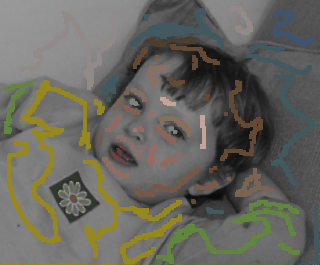mark</center></td>
        <td ><center>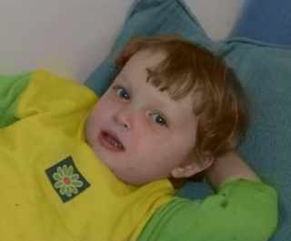结果</center></td>
    </tr>
</table>


## compression

waiting


## deblur

waiting


## dehaze

1. (2009 CVPR)**Single Image Haze Removal Using Dark Channel Prior**  [code](https://github.com/hermosayhl/image_processing/tree/main/dehaze/single_dehaze_he)  [知乎](https://zhuanlan.zhihu.com/p/440903916)

    何恺明大名鼎鼎的暗通道先验去雾，2009 CVPR best paper

    <table>
        <tr>
            <td align='center' valian='middle'><center>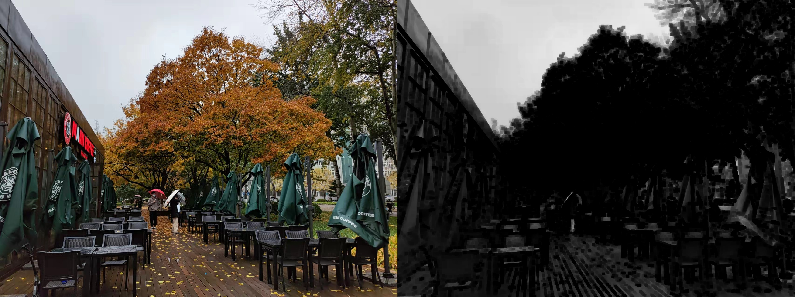无雾场景</center></td>
            <td align='center' valian='middle'><center>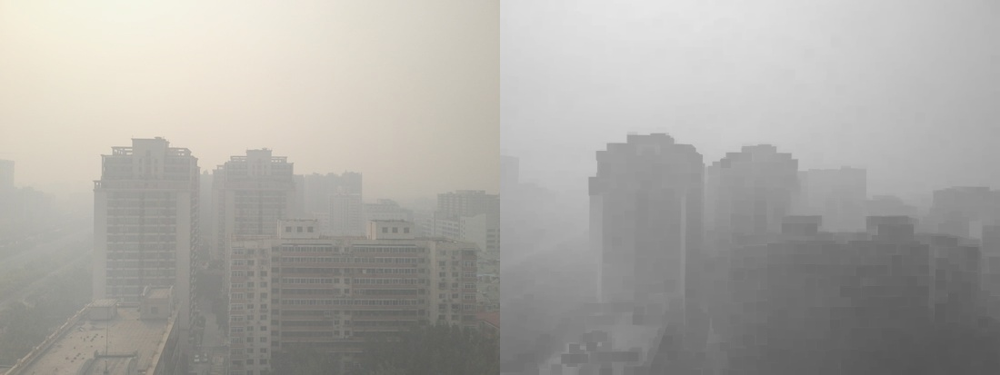有雾场景</center></td>
        </tr>
    </table>

    <table>
        <tr>
            <td align='center' valian='middle'><center>输入</center></td>
            <td align='center' valian='middle'><center>结果</center></td>
        </tr>
    </table>

    代码中包含了暗通道先验验证、guided filter 精细化等内容。

2. (2015 TIP)**A Fast Single Image Haze Removal Algorithm Using Color Attenuation Prior**  [code](https://github.com/hermosayhl/image_processing/tree/main/dehaze/fast_cap)

    基于颜色衰减先验的去雾算法，使用机器学习估计参数

    颜色衰减先验

    <center>
    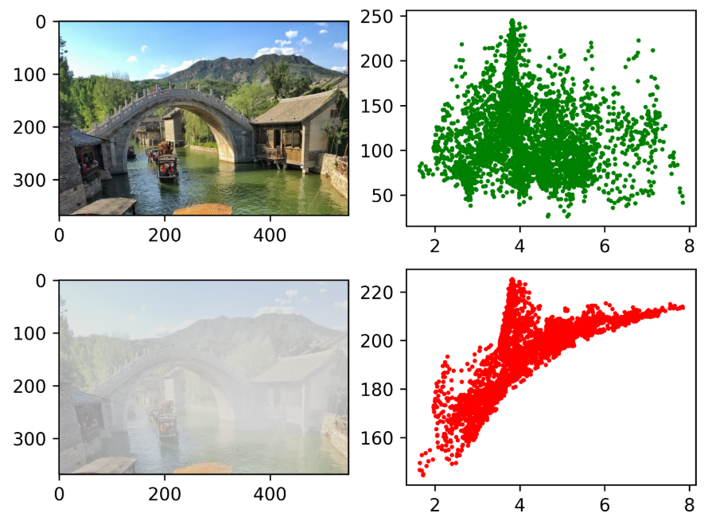
    </center>

    去雾流程

    <table>
        <tr>
            <td align='center' valian='middle'><center>输入</center></td>
            <td align='center' valian='middle'><center>深度图</center></td>
            <td align='center' valian='middle'><center>暗通道</center></td>
        </tr>
        <tr>
        	<td align='center' valian='middle'><center>引导滤波</center></td>
            <td align='center' valian='middle'><center>最远点</center></td>
            <td align='center' valian='middle'><center>结果</center></td>
        </tr>
    </table>


## denoise

去噪算法

1. (1990 TPAMI)**Scale-space and edge detection using anisotropic diffusion**   [code](https://github.com/hermosayhl/image_processing/tree/main/denoise/anisotropic_diffusion)  [知乎](https://zhuanlan.zhihu.com/p/443182644)

    anisotropic_diffusion 各向异性滤波

    <table>
        <tr>
            <td align='center' valian='middle'><center>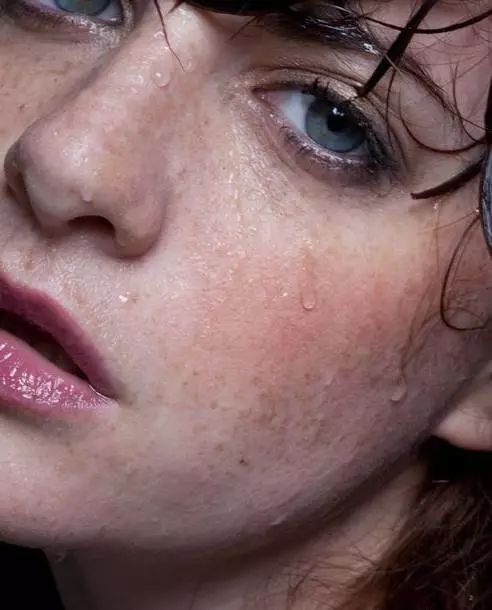输入</center></td>
            <td align='center' valian='middle'><center>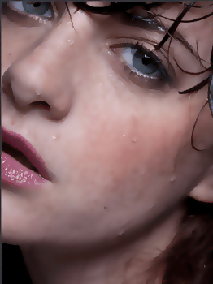结果</center></td>
        </tr>
    </table>

2. gaussian filter 高斯滤波   [code](https://github.com/hermosayhl/image_processing/tree/main/denoise/gaussi_filter)

    后续将出优化专篇。

    <table>
        <tr>
            <td align='center' valian='middle'><center>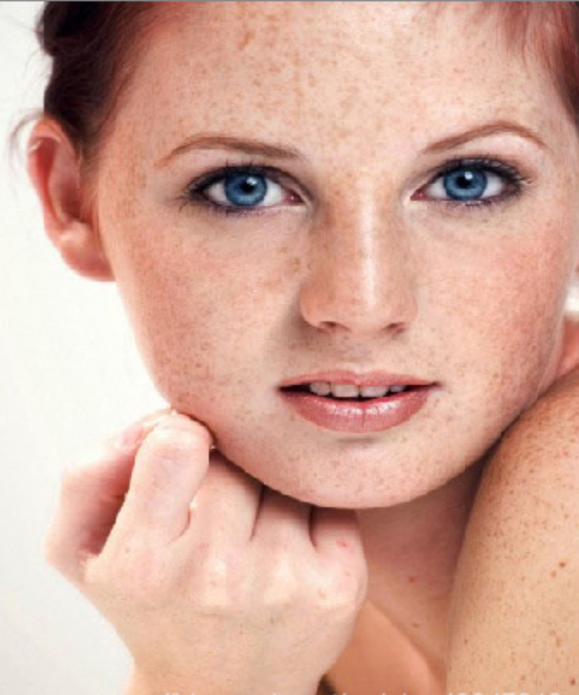输入</center></td>
            <td align='center' valian='middle'><center>结果</center></td>
        </tr>
    </table>

3. bilateral filter 双边滤波   [code](https://github.com/hermosayhl/image_processing/tree/main/denoise/bilateral_filter)

    提供 CPU/CUDA 实现，日后出优化专篇。 

    <table>
        <tr>
            <td align='center' valian='middle'><center>输入</center></td>
            <td align='center' valian='middle'><center>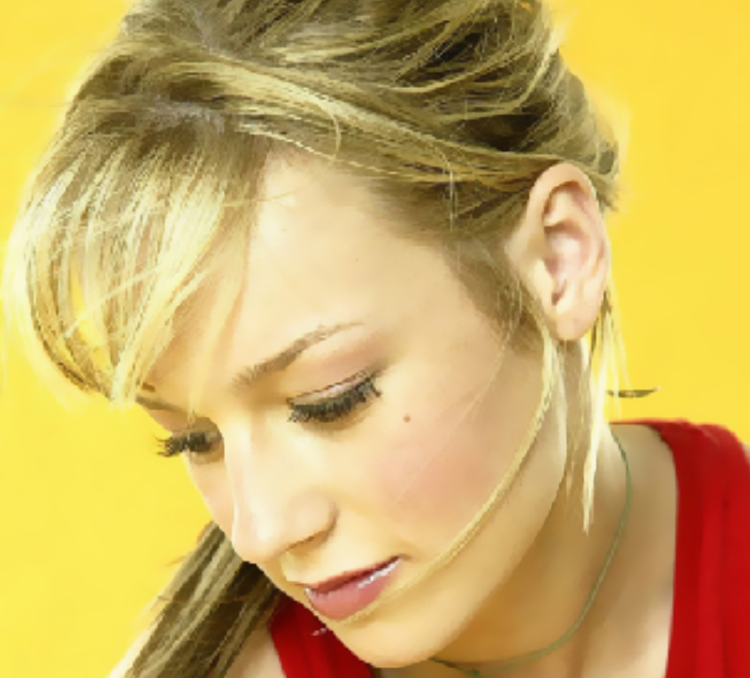结果</center></td>
        </tr>
    </table>

4. (2006 ECCV)**A Fast Approximation of the Bilateral Filter using a Signal Processing Approach**   [code](https://github.com/hermosayhl/image_processing/tree/main/denoise/bilateral_grid)

    bilateral filter using grid 网格加速双边滤波，目前参考官方实现，日后出 CUDA 版本。

    <table>
        <tr>
            <td align='center' valian='middle'><center>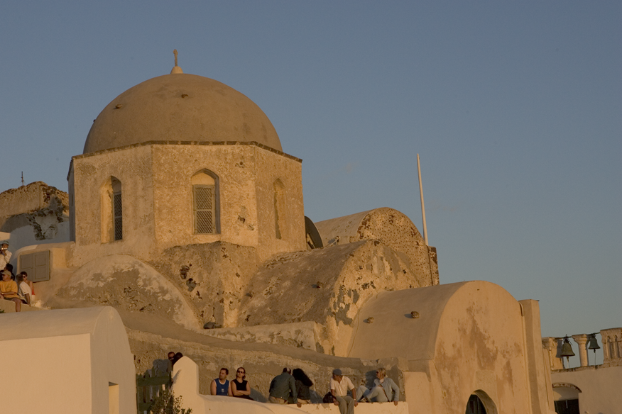输入</center></td>
            <td align='center' valian='middle'><center>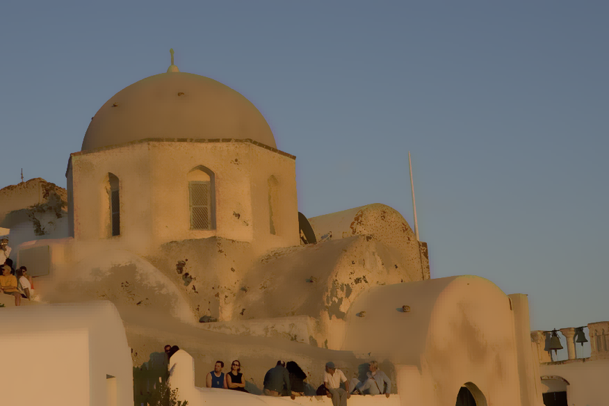结果</center></td>
        </tr>
    </table>

5. (2005)**A non-local algorithm for image denoising**    [code](https://github.com/hermosayhl/image_processing/tree/main/denoise/non_local_means)

    non local means 滤波，提供 CPU/CUDA 实现。后续出优化专篇，其中涉及快速均值滤波。

    <table>
        <tr>
            <td align='center' valian='middle'><center>输入</center></td>
            <td align='center' valian='middle'><center>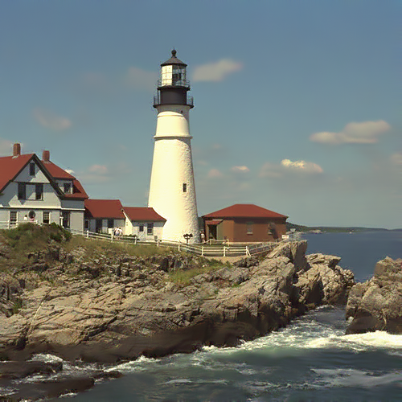结果</center></td>
        </tr>
    </table>

6. (2010 ECCV)**Guided Image Filtering**   [code](https://github.com/hermosayhl/image_processing/tree/main/denoise/guided_filter)  [知乎](https://zhuanlan.zhihu.com/p/438206777)

    何恺明大佬的经典之作，引导滤波（导向滤波），将引导图的高频以线性加权的方式叠加到输入图的低频上，可以完成去噪等多项任务，也可以将其归纳到 filter 那一章节中。

    目前只提供了 CPU 上的 C++ 简单实现，由于涉及快速均值滤波暂无高性能实现；同时 Fast Guided Filtering 也在计划之中。

    （1）去噪（*线性时间复杂度*！保边滤波！）

    <table>
    	<tr>
            <td align='center' valian='middle'><center>输入</center></td>
            <td align='center' valian='middle'><center>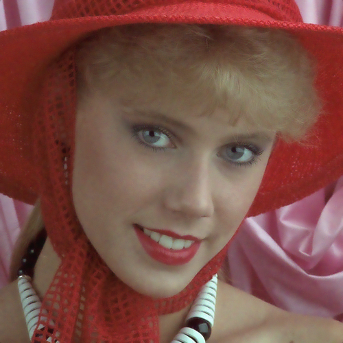输出</center></td>
        </tr>
    </table>

    （2）细化权重（如抠图）

    <table>
    	<tr>
            <td align='center' valian='middle'><center>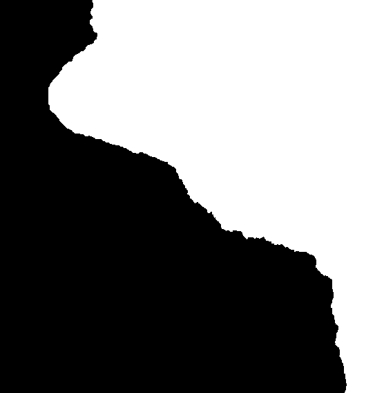掩码</center></td>
            <td align='center' valian='middle'><center>引导图</center></td>
            <td align='center' valian='middle'><center>输出</center></td>
        </tr>
    </table>

    类似地，引导滤波还可以用于细化权重图边缘，如在暗通道先验去雾中细化透射率图。

    （3）细节增强

    <table>
    	<tr>
            <td align='center' valian='middle'><center>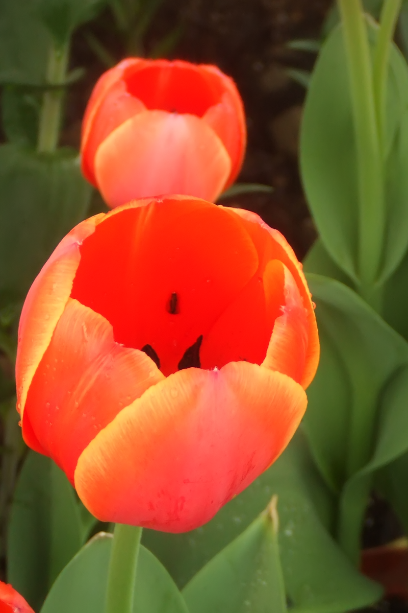输入</center></td>
            <td align='center' valian='middle'><center>bilateral filter</center></td>
            <td align='center' valian='middle'><center>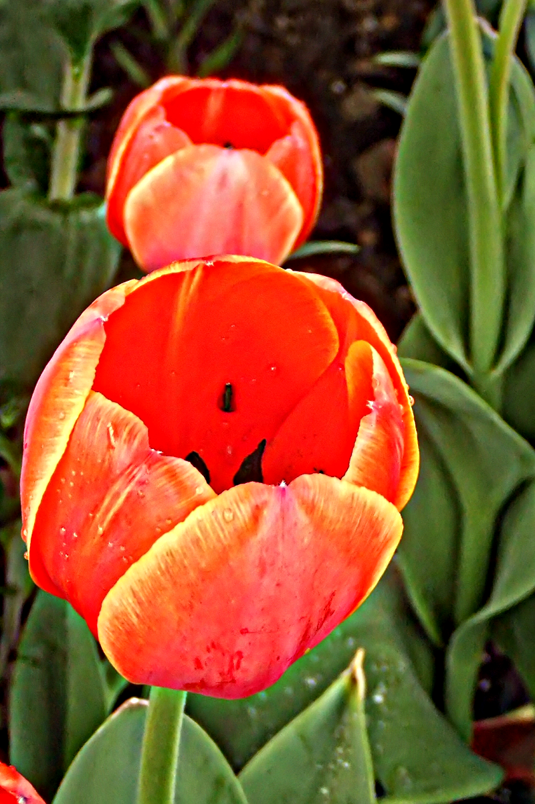guided filter</center></td>
        </tr>
    </table>

    更多应用查看原论文。

    

## detection

1. (1986)**A Computational Approach to Edge Detection**   [code](https://github.com/hermosayhl/image_processing/tree/main/detection/canny)  [知乎](https://zhuanlan.zhihu.com/p/447565904)
    Canny 边缘检测算法。

    <table>
        <tr>
            <td align='center' valian='middle'><center>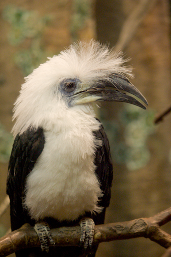输入</center></td>
            <td align='center' valian='middle'><center>结果</center></td>
        </tr>
    </table>

2. (1988)**A combined corner and edge detector**  [code](https://github.com/hermosayhl/image_processing/tree/main/detection/harris)  [知乎](https://zhuanlan.zhihu.com/p/449970674)

    Harris 角点检测算法。 

    <table>
        <tr>
            <td align='center' valian='middle'><center>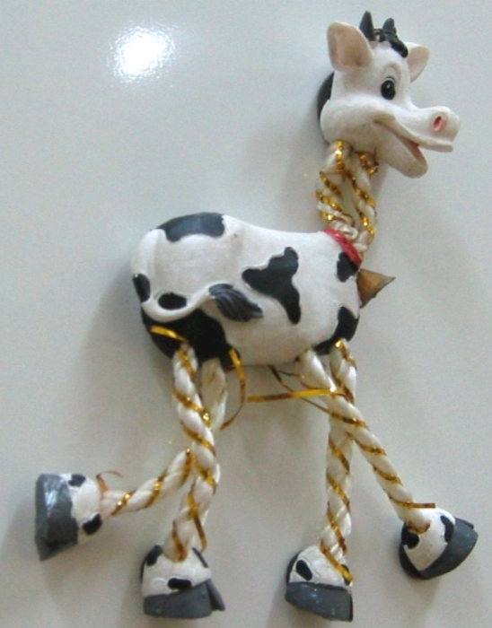输入</center></td>
            <td align='center' valian='middle'><center>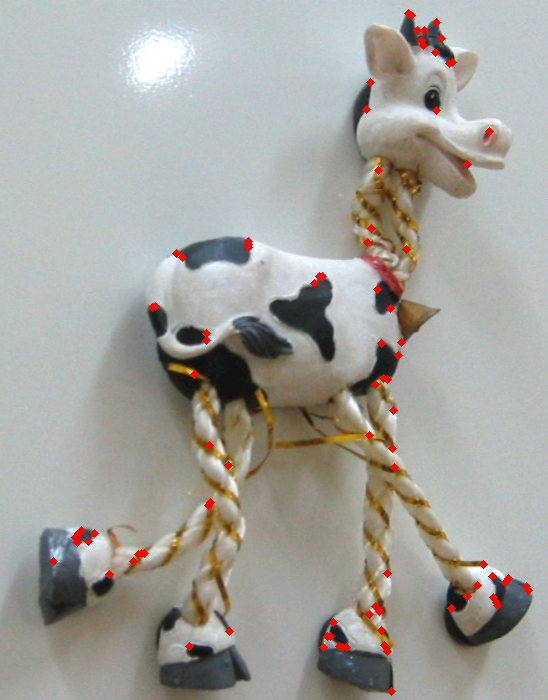结果</center></td>
        </tr>
    </table>

3. **Laplace** 算子 [code](https://github.com/hermosayhl/image_processing/tree/main/detection/laplace)  [知乎](https://zhuanlan.zhihu.com/p/446286009)

    （1）边缘检测。

    <table>
        <tr>
            <td align='center' valian='middle'><center>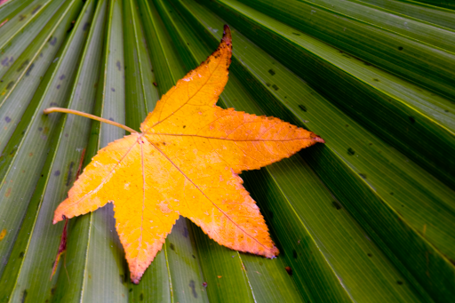输入</center></td>
            <td align='center' valian='middle'><center>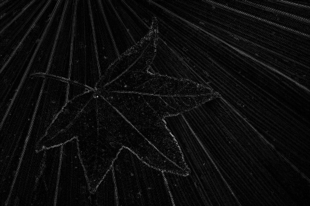结果</center></td>
        </tr>
    </table>

    （2）**LOG**（Laplacian of Gaussian）检测特征点

    <table>
        <tr>
            <td align='center' valian='middle'><center>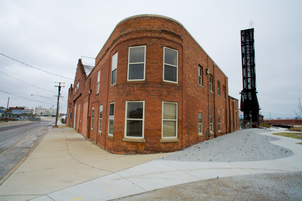输入</center></td>
            <td align='center' valian='middle'><center>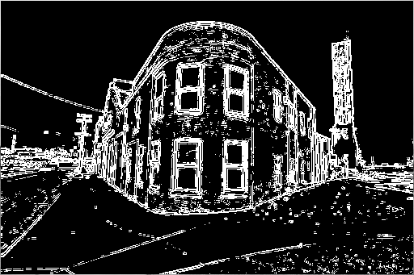边缘</center></td>
        </tr>
        <tr>
            <td align='center' valian='middle'><center>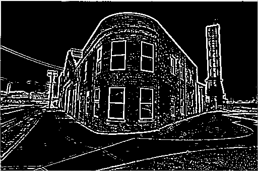NMS</center></td>
            <td align='center' valian='middle'><center>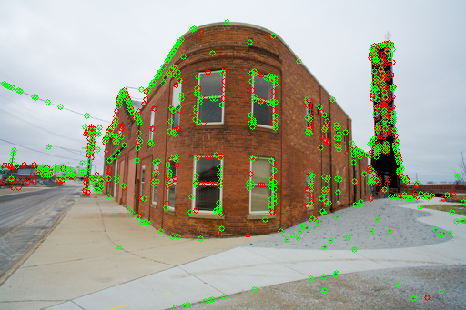特征点</center></td>
        </tr>
    </table>

4. (1983)**A Multiresolution Spline with Application to Image Mosaics** [code](https://github.com/hermosayhl/image_processing/tree/main/detection/laplace_pyramid)  [知乎](https://zhuanlan.zhihu.com/p/454085730)

    Laplace Pyramid 拉普拉斯金字塔。

    （1）图像压缩

    <table>
        <tr>
            <td align='center' valian='middle'><center>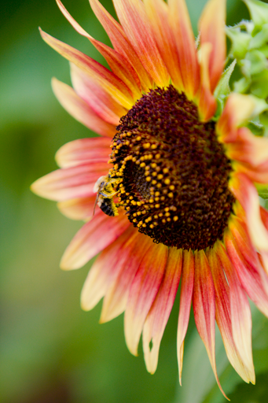输入</center></td>
            <td align='center' valian='middle'><center>压缩</center></td>
        </tr>
    </table>

    （2）图像融合

    <table>
    	<tr>
            <td align='center' valian='middle'><center>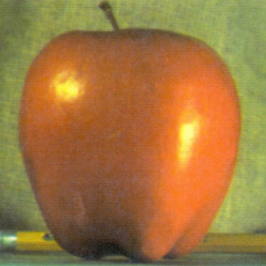左图</center></td>
            <td align='center' valian='middle'><center>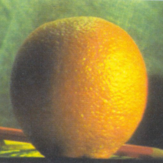右图</center></td>
        </tr>
        <tr>
            <td align='center' valian='middle'><center>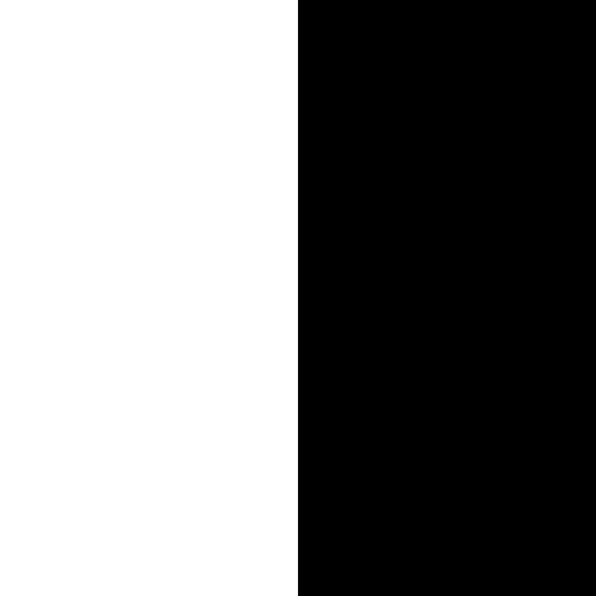掩码</center></td>
            <td align='center' valian='middle'><center>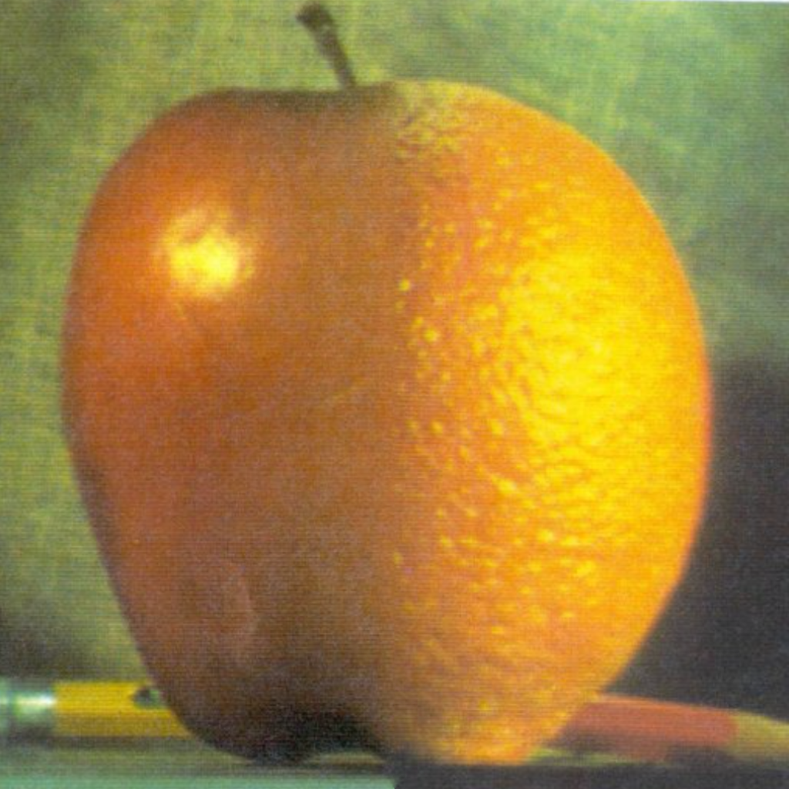结果</center></td>
        </tr>
    </table>

5. (2004 IJCV)**Distinctive Image Featuresfrom Scale-Invariant Keypoints**  [code](https://github.com/hermosayhl/image_processing/tree/main/detection/sift/cpu) [知乎](https://zhuanlan.zhihu.com/p/462061756)

    sift 尺度不变特征变换匹配算法！

    在 CNN 火以前，计算机视觉中 SOTA 的图像特征提取器，分为两个阶段——特征检测 + 特征描述，提取的特征具有尺度不变性、旋转不变性、亮度不变性等。

    这里只实现了第一阶段，利用 LOG 金字塔检测特征点，正确性尚未验证。后续有空会更新后续的特征点描述，并封装成一个接口（CPU/CUDA）。

    <table>
    	<tr>
            <td align='center' valian='middle'><center>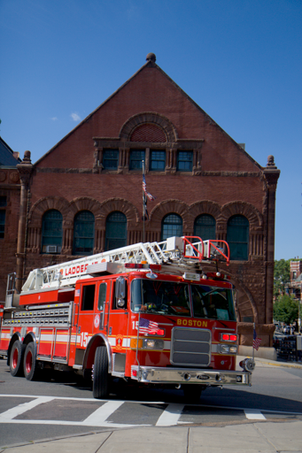输入</center></td>
            <td align='center' valian='middle'><center>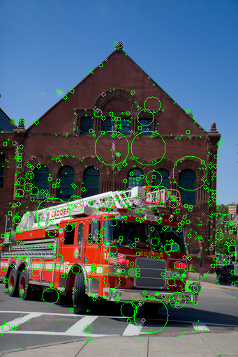结果</center></td>
        </tr>
    </table>

6. (1997 IJCV)**SUSAN: A New Approach to Low Level Image Processing** [code](https://github.com/hermosayhl/image_processing/tree/main/detection/SUSAN) [知乎](https://zhuanlan.zhihu.com/p/450395128)

    SUSAN，比较有意思的一个图像处理算子，可以处理包括角点检测、边缘检测、去噪等。

    （1）角点检测

    <table>
    	<tr>
            <td align='center' valian='middle'><center>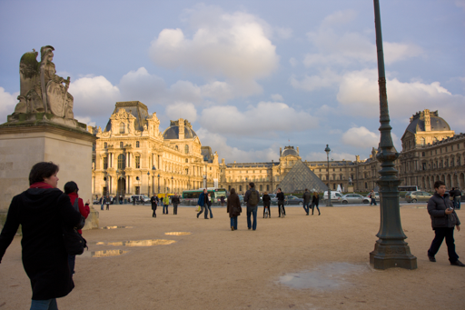输入</center></td>
            <td align='center' valian='middle'><center>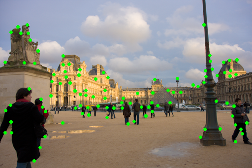输出</center></td>
        </tr>
    </table>

    （2）边缘检测

    <table>
    	<tr>
            <td align='center' valian='middle'><center>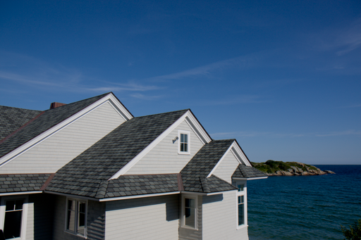输入</center></td>
            <td align='center' valian='middle'><center>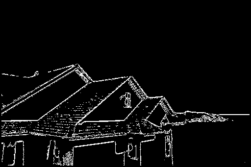输出</center></td>
        </tr>
    </table>

    （3）去噪

    <table>
    	<tr>
            <td align='center' valian='middle'><center>输入</center></td>
            <td align='center' valian='middle'><center>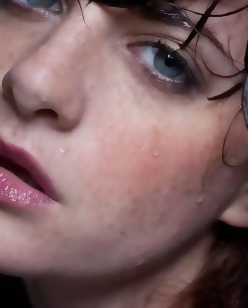输出</center></td>
        </tr>
    </table>


## editing

1. (2003 SIGGRAPH)**Poisson Image Editing**  [code](https://github.com/hermosayhl/image_processing/tree/main/editing/possion_image_editing)   [知乎](https://zhuanlan.zhihu.com/p/453095752)

    泊松编辑（泊松融合），非常经典的文章，基于梯度域做图像编辑、图像融合！

    目前提供 C++ 实现。
    
    <table>
    	<tr>
            <td align='center' valian='middle'><center>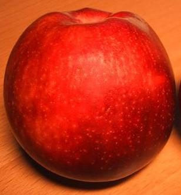背景</center></td>
            <td align='center' valian='middle'><center>前景</center></td>
            <td align='center' valian='middle'><center>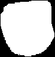掩码</center></td>
        </tr>
        <tr>
            <td align='center' valian='middle'><center>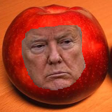直接粘贴</center></td>
            <td align='center' valian='middle'><center>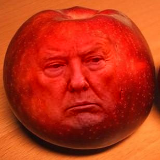初步结果</center></td>
            <td align='center' valian='middle'><center>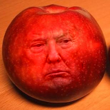梯度混合</center></td>
    </tr>
    </table>

    更多的应用包括纹理交换、局部纹理消除、局部纹理抹平、局部色彩变幻、局部动态范围压缩等，详情见论文和我的 [知乎](https://zhuanlan.zhihu.com/p/453095752)。
    
    

## filter

这里会记录一些就基础、特殊的滤波器，提供 CPU 实现，有空尽力添加 CPU 加速实现和 CUDA 实现。

1. **最值滤波**  [code](https://github.com/hermosayhl/image_processing/tree/main/filter/max_min_filter)  [知乎](https://zhuanlan.zhihu.com/p/576819666)

    <table>
    	<tr>
            <td align='center' valian='middle'><center>输入</center></td>
            <td align='center' valian='middle'><center>输出</center></td>
        </tr>
    </table>

    最值滤波提供多种实现，测试图像分辨率 2832 x 4256，滤波直径 81，只测试局部邻域最小值，i5-10400f 单核单线程，C++ 开 O2 优化，结果如下

    | 运行时间 | 时间复杂度 | 空间复杂度       | 时间复杂度       |
    | -------- | ---------- | ---------------- | ---------------- |
    | 暴力     | 65.141 s   | O(H * W * k * k) | O(1)             |
    | 拆分     | 1.656 s    | O(H * W * k)     | O(HW)            |
    | 单调队列 | 0.672 s    | O(HW)            | O(max(H, W) + k) |
    | 动态规划 | 0.391 s    | O(HW)            | O(max(H, W))     |

2. **均值滤波**   [code](https://github.com/hermosayhl/image_processing/tree/main/filter/mean_filter)

    实现方式有盒子滤波、积分图，在引导滤波、人像美颜中都多有应用，在计划中。


## fusion

1. (2007)**Exposure Fusion**  [code](https://github.com/hermosayhl/image_processing/tree/main/fusion/exposure_fusion)   [知乎](https://zhuanlan.zhihu.com/p/455674916)

    经典的多曝光图像融合算法，但要求强对齐，使用了 Laplace Pyramid 融合消除 halo。

    <table>
    	<tr>
            <td align='center' valian='middle'><center>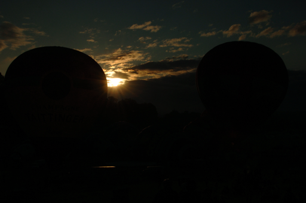曝光 1</center></td>
            <td align='center' valian='middle'><center>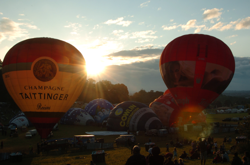曝光 2</center></td>
            <td align='center' valian='middle'><center>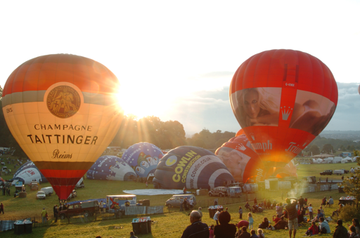曝光 3</center></td>
        </tr>
        <tr>
            <td align='center' valian='middle'><center>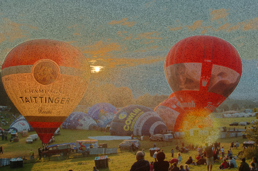直接融合 </center></td>
            <td align='center' valian='middle'><center>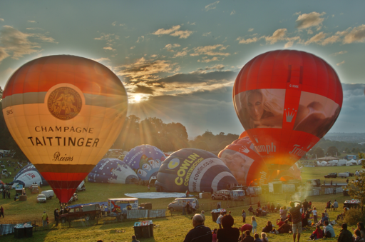高斯平滑 </center></td>
            <td align='center' valian='middle'><center>金字塔融合</center></td>
        </tr>
    </table>


## geometry

几何。这部分比较难，是计算机视觉三大问题之一。个人准备在这模块学习一些多视角变换、相机标定等知识，应用的话如一些 RACSAC、stitching 算法等等。

waiting

1. **二维旋转** [code](https://github.com/hermosayhl/image_processing/tree/main/geometry/affine_transformation/rotation)

    


## HDR

这部分东西也比较多，资料不好找。目前先实现一些简单的 HDR，动态范围压缩。

1. (2002)**Fast Bilateral Filtering for the Display of High-Dynamic-Range Images** [code](https://github.com/hermosayhl/image_processing/tree/main/hdr/bilateral_hdr)   [知乎](https://zhuanlan.zhihu.com/p/496261579)

    <table>
    	<tr>
            <td align='center' valian='middle'><center>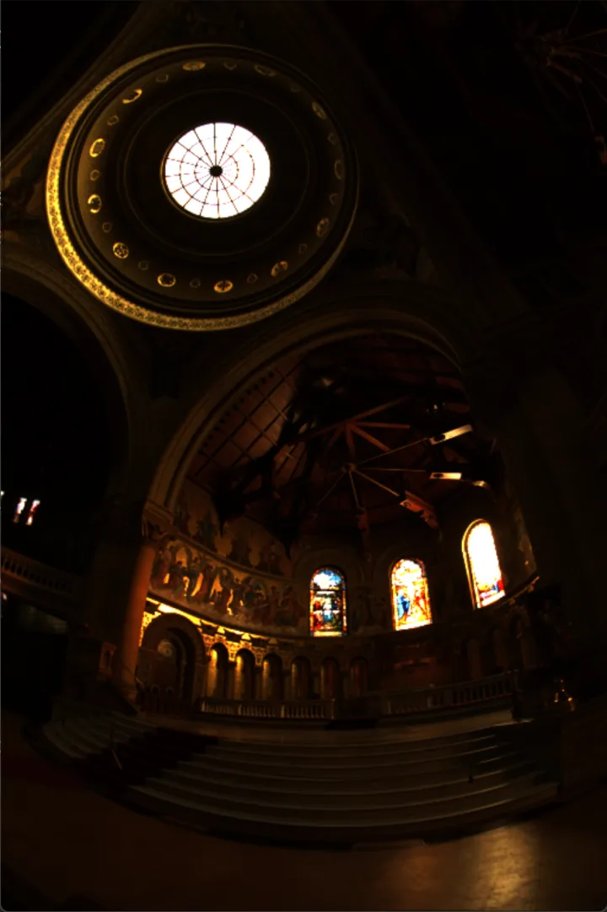输入</center></td>
            <td align='center' valian='middle'><center>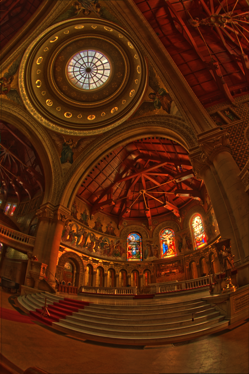输出</center></td>
            </tr>
    </table>
    
    


## inpainting

waiting


## interpolation

1. **最近邻 、bilinear 、bicubic**  [code]() [知乎](https://zhuanlan.zhihu.com/p/495413548)

    目前只实现了 bilinear 和 bicubic 的 CPU 版本实现（为加速），后续会推出加速篇（CPU 优化和 CUDA 优化版本）

    （1）bilinear

    <table>
    	<tr>
            <td align='center' valian='middle'><center>512x341</center></td>
            <td align='center' valian='middle'><center>2400x1600</center></td>
            <td align='center' valian='middle'><center>200x140</center></td>
        </tr>
    </table>

    （2）bicubic

    <table>
    	<tr>
            <td align='center' valian='middle'><center>512x341</center></td>
            <td align='center' valian='middle'><center>1800x1200</center></td>
            <td align='center' valian='middle'><center>300x200</center></td>
        </tr>
    </table>
    
    
2. (2007 TOG)**Joint Bilateral Upsampling**    [code](https://github.com/hermosayhl/image_processing/tree/main/interpolation/joint_bilateral_upsampling)  [知乎]()

    联合双边上采样算法。

    这部分写了一版光流上采样的代码，但是效果不太好，后续有空再 debug。上采样算法不适合做光流，后续有空改成深度图试试。
    
    <table>
    	<tr>
            <td align='center' valian='middle'><center>低分辨率光流</center></td>
            <td align='center' valian='middle'><center>引导图</center></td>
            <td align='center' valian='middle'><center>高分辨率光流</center></td>
        </tr>
    </table>
    
    

## low-light

1. (2011 SIGGRAPH)**Fast efficient algorithm for enhancement of low lighting video**   [code](https://github.com/hermosayhl/image_processing/tree/main/low-light/dong)  [知乎](https://zhuanlan.zhihu.com/p/500023711)

    比较有创新的算法，对低光照图像的反转图像做去雾，再取反即可。

    <table>
    	<tr>
            <td align='center' valian='middle'><center>输入</center></td>
            <td align='center' valian='middle'><center>输出</center></td>
        </tr>
        <tr>
            <td align='center' valian='middle'><center>反转图像</center></td>
            <td align='center' valian='middle'><center>去雾图像</center></td>
        </tr>
    </table>

    类似，可以对有雾图像取反，做低光照增强，再取反得到去雾图像，结果好坏很大程序上取决于去雾算法的好坏。

    <table>
    	<tr>
            <td align='center' valian='middle'><center>有雾图像</center></td>
            <td align='center' valian='middle'><center>暗通道</center></td>
        </tr>
    	<tr>
            <td align='center' valian='middle'><center>增强结果</center></td>
            <td align='center' valian='middle'><center>去雾结果</center></td>
        </tr>
    </table>

2. **histogram_equalization** 直方图均衡  [code](https://github.com/hermosayhl/image_processing/tree/main/low-light/HE)

    直方图均衡算法，比较简单，可以增大图像的对比度，根据累积概率分布重构图像像素分布，增大动态范围。

    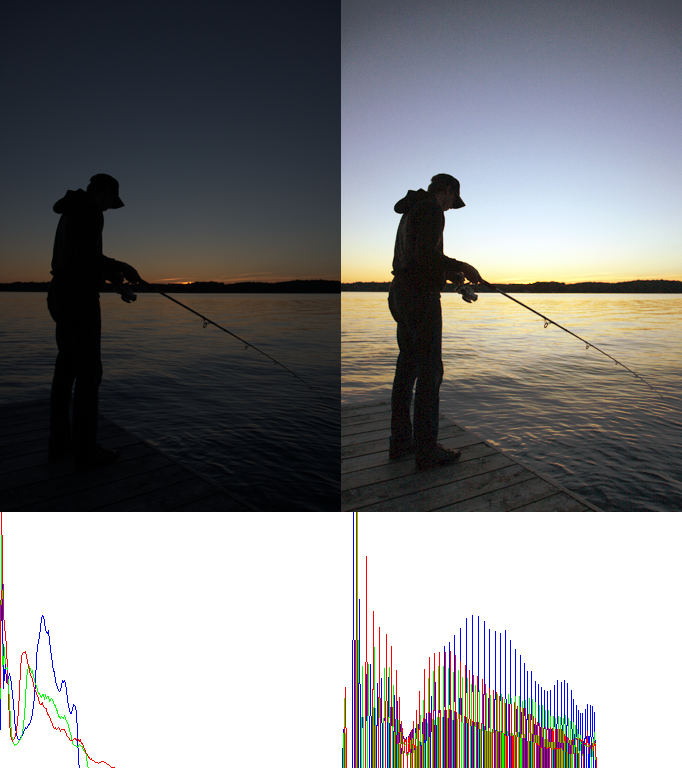

3.  **MSRCR**   [code](https://github.com/hermosayhl/image_processing/tree/main/low-light/msrcr)   [知乎](https://zhuanlan.zhihu.com/p/500023711)

    多尺度基于 Retinex 的图像增强算法

    <table>
    	<tr>
            <td align='center' valian='middle'><center>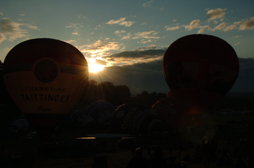输入</center></td>
            <td align='center' valian='middle'><center>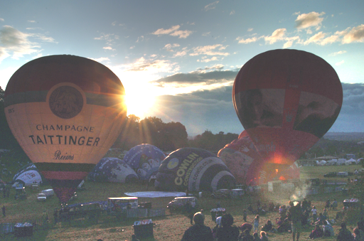SSR</center></td>
        </tr>
        <tr>
            <td align='center' valian='middle'><center>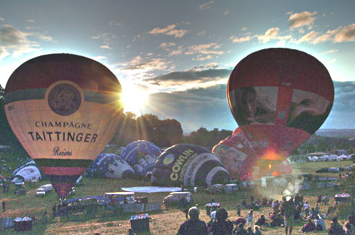MSR</center></td>
            <td align='center' valian='middle'><center>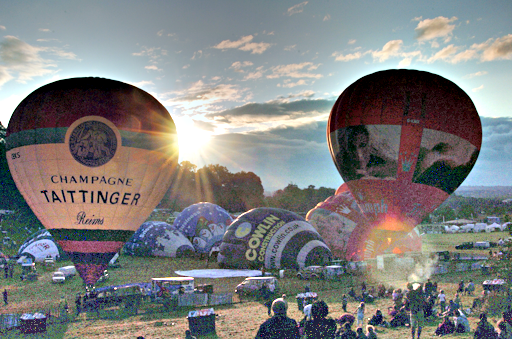MSRCR</center></td>
        </tr>
    </table>


## matting

1. **A Bayesian Approach to Digital Matting**   [code](https://github.com/hermosayhl/image_processing/tree/main/matting/bayers_matting)  [知乎](https://zhuanlan.zhihu.com/p/458797699)

    目前提供 Linux 下的 C++ 实现，在 Windows 上使用 Eigen3 求解方程会死循环。在我电脑上（i5-10400f），单线程 0.48s 处理一张 640x480 的图像。

    <table>
    	<tr>
            <td align='center' valian='middle'><center>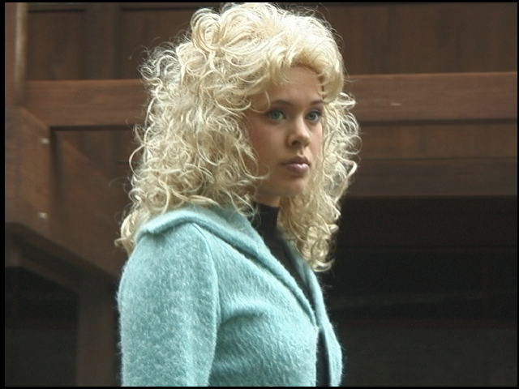输入</center></td>
            <td align='center' valian='middle'><center>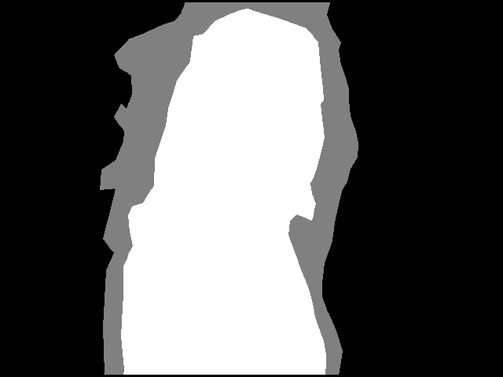trimap</center></td>
            <td align='center' valian='middle'><center>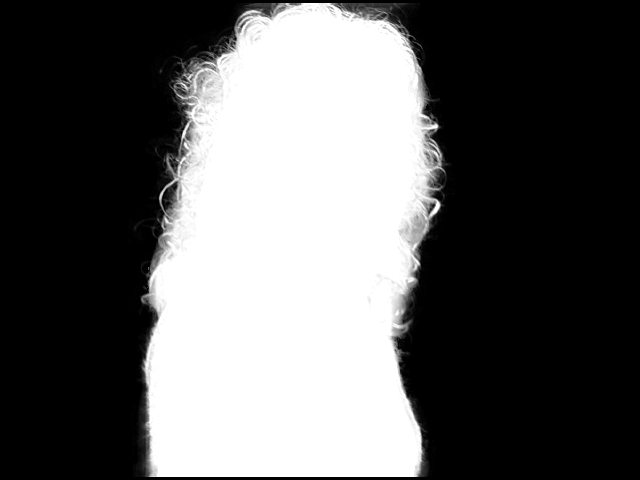alpha</center></td>
        </tr>
    </table>


## optical flow


## super resolution


## 参考

测试图像来源

```latex
@inproceedings{bychkovsky2011learning,
  title={Learning photographic global tonal adjustment with a database of input/output image pairs},
  author={Bychkovsky, Vladimir and Paris, Sylvain and Chan, Eric and Durand, Fr{\'e}do},
  booktitle={CVPR 2011},
  pages={97--104},
  year={2011},
  organization={IEEE}
}
```

