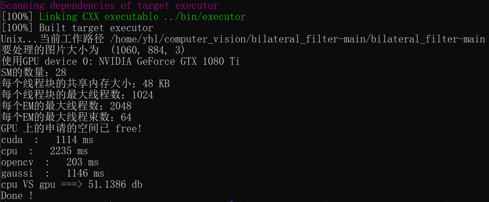
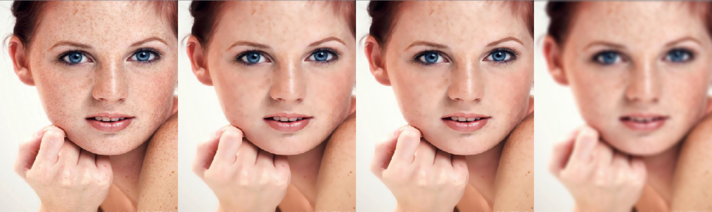

# Bilateral filter

## 1. 环境

```yaml
cmake: 3.19.8
gcc/g++: 7.5.0
OpenCV: 4.5.2
CUDA: 10.0
```


## 2. Sample

```shell
sh run.sh
```


如果要换成 cuda 程序，只需要修改以下几行

```cmake

# CUDA
find_package(CUDA REQUIRED)
set(CUDA_NVCC_FLAGS -G;-g)

# 生成 cuda 可执行文件
cuda_add_executable(executor src/bilateral_filter.cu)

# add_executable(executor src/bilateral_filter.cpp)

```

结果如下：



[时间对比]


从左到右分别是：含噪声原图、CPU 双边滤波、GPU 双边滤波、CPU 高斯滤波





## 3. 原理


## 4. 实现


## 5. cuda 实现


## 6. 探究实验

随着 space 方差  和 value 方差效果如何变化，结合公式分析


做一个矩阵，行列分别是不同方差，观察


## 7. 存在的问题

Details 展示


非线性，复杂度较高（这里可以分析一下复杂度），不同位置的卷积模板不同，不能预先计算，比较费时


对于彩色图像可能会产生奇怪的光圈，后续可以考虑换成其他颜色空间


容易产生梯度反转的伪影


## 8. Reference

