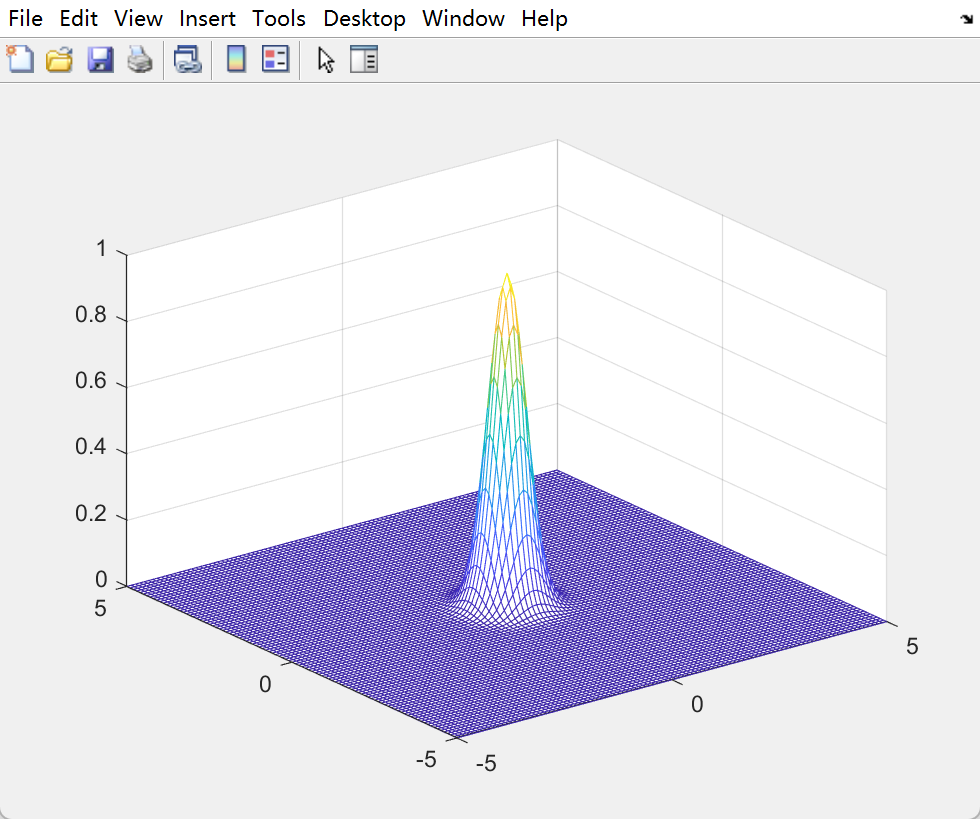
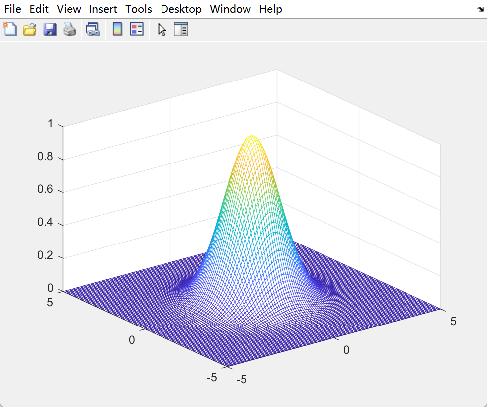
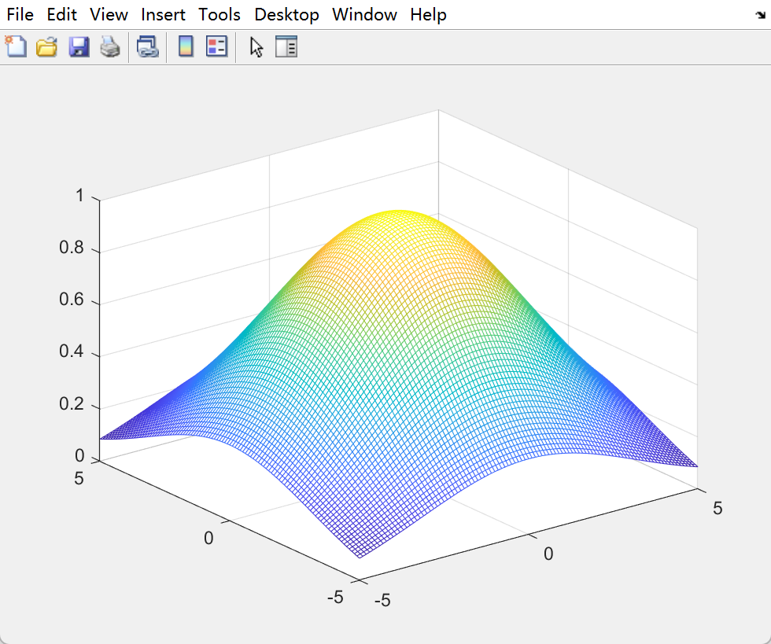
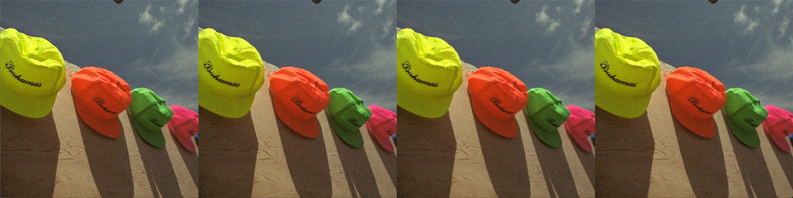

# 高斯滤波

又名高斯模糊，最基础也是最简单的滤波算法之一。

高斯滤波核是空域上的低通滤波器，从中心到四周是对称的，距离越远，影响力越小。以下是二维高斯核的空间分布，方差分别是 0.5, 1.5 和 4.5 。

<center class="half">     </center>

在 sift 中还特别说明，高斯卷积核是实现尺度变换的唯一变换核，并且是唯一的线性核。


## 原理

二维高斯函数在高斯滤波中的形式
$$
G(x, y, x_0, y_0) = \frac{1}{2\pi {\sigma}^2} {e^{-\frac{{(x - x_0)}^2 + {(y - y_0)}^2}{2{\sigma}^2}}}
$$
其中，$(x_0, y_0)$ 是中心的坐标，$(x, y)$ 和滤波核窗口内任意一点的坐标。

以上求的只是 $(x, y)$ 对 $(x_0, y_0)$  的权重，也就是影响力，还要乘以  $(x, y)$  的像素值，最后加权得到中心的滤波结果。

但实际图像中，滤波器内部的点是离散的，而且是只有离散的一部分（滤波器窗口限制了），因此，需要对权重做归一化
$$
\begin{aligned}
\hat{G}(x, y, x_0, y_0) &= \frac{1}{Z} \times \frac{1}{2\pi {\sigma}^2} {e^{-\frac{{(x - x_0)}^2 + {(y - y_0)}^2}{2{\sigma}^2}}} \\
Z &= \sum_{(x,y) \in \Omega}{\frac{1}{2\pi {\sigma}^2} {e^{-\frac{{(x - x_0)}^2 + {(y - y_0)}^2}{2{\sigma}^2}}}}
\end{aligned}
$$
$\Omega$ 是卷积核窗口的所有点集合。

因此，高斯滤波的操作就是，原图中任意一点 $(u, v)$，其值 $V(u, v)$
$$
Gaussi(u, v) = \sum_{(x, y) \in \Omega}{\hat{G}(x, y, u, v) \times V(x, y)}
$$

## 改进

给定图像宽高 $W \times H$，滤波器大小为 $X \times Y$，每个点都要对周围窗口 $X \times Y$ 的点进行距离加权计算，则高斯滤波的时间复杂度是 $O(W \times H \times X \times Y)$ ，复杂度相对较高。

但其实，两个一维高斯滤波可以替代二维的高斯滤波，从公式出发
$$
\begin{aligned}
G(x, y, x_0, y_0) &= \frac{1}{2\pi {\sigma}^2} {e^{-\frac{{(x - x_0)}^2 + {(y - y_0)}^2}{2{\sigma}^2}}} \\
&= \frac{1}{2\pi {\sigma}^2}{e^{-\frac{{(x - x_0)}^2}{2{\sigma}^2}} \times e^{-\frac{{(y - y_0)}^2}{2{\sigma}^2}} } \\
&= \frac{1}{\sqrt{2\pi {\sigma}^2}}{e^{-\frac{{(x - x_0)}^2}{2{\sigma}^2}}} \times \frac{1}{\sqrt{2\pi {\sigma}^2}}{e^{-\frac{{(y - y_0)}^2}{2{\sigma}^2}}}
\end{aligned}
$$
等效于两个一维的高斯卷积核 **相继** 滤波。

为什么说相继呢？
$$
\begin{aligned}
\hat{G}(x, y, x_0, y_0) &= \frac{1}{Z} \times \frac{1}{2\pi {\sigma}^2} {e^{-\frac{{(x - x_0)}^2 + {(y - y_0)}^2}{2{\sigma}^2}}} \\
 &= \frac{1}{Z_x} \times \frac{1}{\sqrt{2\pi {\sigma}^2}}{e^{-\frac{{(x - x_0)}^2}{2{\sigma}^2}}} \times \frac{1}{Z_y} \times \frac{1}{\sqrt{2\pi {\sigma}^2}}{e^{-\frac{{(y - y_0)}^2}{2{\sigma}^2}}}\\ \\
 &= \hat{G}(x, x_0) \times \hat{G}(y, y_0) \\ \\
Z_x &= \sum_{(x,y) \in \Omega}{\frac{1}{2\pi {\sigma}^2} {e^{-\frac{{(x - x_0)}^2}{2{\sigma}^2}}}} \\
Z_y &= \sum_{(x,y) \in \Omega}{\frac{1}{2\pi {\sigma}^2} {e^{-\frac{{(y - y_0)}^2}{2{\sigma}^2}}}}
\end{aligned}
$$
代入到图像滤波中，先对 $X$ 方向做一次一维的高斯滤波，再对 $Y$ 方向做一次一维的高斯滤波,

关键就是，做 $Y$ 方向滤波是在经过了 $X$ 方向滤波的结果上继续滤波。

**举个例子**

滤波核大小为 **3**，中间的点位置为 **5**，则正常的二维高斯滤波，有
$$
\begin{aligned}
Gaussi(V_5) &= w^{xy}_1 \cdot v_1 + w^{xy}_2 \cdot v_2 + w^{xy}_3 \cdot v_3 \\
&+ w^{xy}_4 \cdot v_4 + w^{xy}_5 \cdot v_5 + w^{xy}_6 \cdot v_6 \\
&+ w^{xy}_7 \cdot v_7 + w^{xy}_8 \cdot v_8 + w^{xy}_9 \cdot v_9
\end{aligned}
$$
但其实，上面的 9 个权重 $w_i$ ，其实只有 **3** 个值，$w_1,w_2,w_5$。

如果是分成 $X$ 方向和 $Y$ 方向的两次一维滤波，有
$$
\begin{aligned}
\hat{Gaussi(V_5)} &= w^y_1 \cdot (w^x_1 \cdot v_1 + w^x_2 \cdot v_2 + w^x_3 \cdot v_3) \\
&+ w^y_2 \cdot (w^x_1 \cdot v_4 + w^x_2 \cdot v_5 + w^x_3 \cdot v_6) \\
&+ w^y_3 \cdot (w^x_1 \cdot v_7 + w^x_2 \cdot v_8 + w^x_3 \cdot v_9)
\end{aligned}
$$
上面两串，随便选出一项，二者都是等价的（忽略前面的归一化项，都是一样的，而且滤波核一定，这俩归一化项也定了）

比如，$v_1$ 点的权重 $w^{xy}_1$ 跟 $w_1^y \cdot w_1^x$，这二者，展开，分别是 $e^{-\frac{{(x_1 - x_5)}^2 + {(y_1 - y_5)}^2}{2{\sigma}^2}}$ 跟 $e^{-\frac{{(x_1 - x_5)}^2}{2{\sigma}^2}} \cdot e^{-\frac{{(y_1 - x_5)}^2}{2{\sigma}^2}}$ ；

比如，$v_2$ 点的权重 $w^{xy}_2$ 跟 $w_1^y \cdot w_2^x$，这二者，展开，分别是 $e^{-\frac{{(x_2 - x_5)}^2 + {(y_2 - y_5)}^2}{2{\sigma}^2}}$ 跟 $e^{-\frac{{(x_2 - x_5)}^2}{2{\sigma}^2}} \cdot e^{-\frac{{(y_1 - x_5)}^2}{2{\sigma}^2}}$ ，后者的第二项 $e^{-\frac{{(y_1 - x_5)}^2}{2{\sigma}^2}}$ 和 $e^{-\frac{{(y_2 - x_5)}^2}{2{\sigma}^2}}$ 是等价的，因为对于$v_1$ 和 $v_2$ 而言，在 $Y$ 方向上和 $v_5$ 的距离都是 1，是相等的，所以，$v_2$ 的权重等价于 $w_2^y \cdot w_2^x$；

...

比如，$v_8$ 点的权重 $w^{xy}_8$ 跟 $w_3^y \cdot w_2^x$，照搬前面利用高斯核对称的性质，可以得出，前者 $w^{xy}_8$ 等价于 $w^{xy}_2$ ，后者等价于 $w_2^y \cdot w_2^x$ ，这俩一样的。

所以，很容易联想到，滤波核大小是 5，7，9.... (2n + 1) 时，这个也是成立的。


## 结果

滤波核大小  11，标准差 $\delta = 3$，滤波结果展示：

从左到右，分别是  噪声图<===>普通2D高斯去噪<===>快速高斯去噪<===>快速高斯去噪 + 边缘处理<===>OpenCV


```yaml
第一次写     :   29 ms
改进后的     :   6 ms
边缘改进     :   4 ms
OpenCV 自带  :  1 ms
PSNR       :   66.02db
```

从左到右，分别是  噪声图<===>普通2D高斯去噪<===>快速1D高斯去噪<===>OpenCV


```yaml
高  :  500
宽  :  500
通道 :  3
第一次写  :   90 ms
改进之后  :   13 ms
OpenCV   :   4 ms
PSNR     :   63.59db
```

### **高斯核大小不变，方差变化**

标准差 $\delta = 0.5$



标准差 $\delta = 1.5$


标准差 $\delta = 4.5$


标准差 $\delta = 20.0$


### 方差不变，高斯核大小变化

kernel = 3


kernel = 7


kernel = 15


## 实现细节

1. 2D 原始的高斯滤波

   普通的二维高斯滤波虽然很简单，就窗口内加权平均，但里面还是有一些加速小技巧的。

2. 1D 改进的高斯滤波

   两个一维的高斯滤波，时间复杂度上就已经加速很多了，但实现细节上还有一些小技巧。