# 原理

Kaiming He 博士的经典之作，2010 ECCV paper，2014 年被 matlab 和 OpenCV 3.0 选入内置算法。

据说有很多经典应用，如去噪，去雾，抠图，HDR 压缩，细节增强，联合上采样等，我的天，太牛批了。我最初知晓，它是作为三大保边平滑算法之一。

## 推导

**最基本假设：滤波输出是引导图像的局部线性变换**

假设，引导图像 $G$， 输出图像 $O$，则对应图像的任意一个位置 $k$，滤波器窗口为 $w_k$，根据上述假设
$$
O_{i} = a_k \cdot G_{i} + b_k, \quad i \in w_k
$$
在保边平滑算法中，这就可以保证，滤波输出 $O$ 的梯度和引导图 $G$ 尽量一致。

现在给定输入图像 $I$，为了让输出 $O$ 在 **局部** 内容上和 $I$ 保持大致相同，则有最优化目标
$$
\begin{aligned}
{\underset {}{\operatorname {min} }}\,{\sum_{i\in w_k}{(O_i - I_i)}}
  &= {\underset {}{\operatorname {min} }}\,{\sum_{i\in w_k}{(a_k \cdot G_i + b_k - I_i)}}\\
\end{aligned}
$$
为了防止除 0（后面的简化公式有），加入一个控制变量 $\epsilon$。
$$
\begin{aligned}
{\underset {}{\operatorname {min} }}\,{\sum_{i\in w_k}{(a_k \cdot G_i + b_k - I_i \,\,\,\, + \epsilon \cdot {a_k}^2) }} \\
\end{aligned}
$$
求上式的最小值，对 $a_k$ 和 $b_k$ 求偏导
$$
\begin{aligned}
\frac {\partial E } {\partial b_k } &= \sum_{i \in w_k}{2b_k + 2(a_k G_i - I_i)} \\
\frac {\partial E } {\partial a_k } &= \sum_{i \in w_k}{(2{G_i}^2 \cdot a_k + 2(b_k - I_i)\cdot G_i + 2\epsilon \cdot a_k )}
\end{aligned}
$$
另上面两项等于 0，有
$$
\begin{aligned}
\sum_{i\in w_k}{b_k} &= \sum_{i\in w_k}{I_i} - \sum_{i\in w_k}{a_k \cdot G_i} \\
b_k &= mean(I)^{w_k} - a_k \cdot mean(G)^{w_k}
\end{aligned}
$$
对 $a_k$ 
$$
\begin{aligned}
\sum_{i\in w_k}{({G_i}^2a_k + \epsilon\cdot a_k)} & = \sum_{i\in w_k}{(G_i\cdot I_i - G_i\cdot b_k)} \\

\sum_{i\in w_k}{({G_i}^2a_k + \epsilon\cdot a_k)} & = \sum_{i\in w_k}{\big(G_i\cdot I_i - G_i\cdot (mean(I)^{w_k} - a_k \cdot mean(G)^{w_k}) \big)} \\

a_k \cdot \sum_{i\in w_k}{({G_i}^2 + \epsilon - G_i \cdot  mean(G)^{w_k} )} &= \sum_{i\in w_k}{(G_i \cdot I_i - G_i \cdot mean(I)^{w_k})} \\

a_k \big[\sum_{i\in w_k}{{G_i}^2} + \sum_{i\in w_k}{\epsilon} - mean(G)^{w_k} \cdot \sum_{i\in w_k}{G_i} \big] &= \sum_{i\in w_k}{(G_i \cdot I_i)} - \sum_{i\in w_k}{G_i \cdot mean(I)^{w_k}} \\

a_k \big[mean({G}^2)^{w_k} + \epsilon - mean(G)^{w_k} \cdot mean(G)^{w_k} \big] &= mean({G\cdot I})^{w_k} - mean(G)^{w_k} \cdot mean(I)^{w_k}\\ \\
\end{aligned}
$$
根据期望，方差以及协方差公式
$$
\begin{aligned}
Var(X) &= E[X^2] - {E[X]}^2\\
Cov(X, Y) &= E[XY] - E[X]\cdot E[Y]
\end{aligned}
$$
可得
$$
\begin{aligned}
a_k \cdot (Var(G)^{w_k} + \epsilon) &= Cov(G, I)^{w_k} \\
a_k = \frac{Cov(G, I)^{w_k}}{Var(G)^{w_k} + \epsilon}
\end{aligned}
$$
所以，$a_k$ 和 $b_k$ 是存在解析解的，可以直接求出来。同时可以发现 $\epsilon$ 是为了防止除 0（网上说的一些防止 $a_k$ 过大，我不能理解）。

不仅如此，可以发现，任意一点 $k$ 及其窗口 $w_k$，就决定了 $a_k$ 和 $b_k$，滤波器窗口之间不存在信息交流，所以存在一定的缺陷。

回到最开始，**滤波输出是引导图像的局部线性变换**
$$
O_{i} = a_k \cdot G_{i} + b_k, \quad i \in w_k
$$
 现在，给定指导图 $G$ 和输入图  $I$，就可以求得 $a_k$ 和 $b_k$，也就是说，对于任意一点 $k$，其窗口内的点（包括点 $k$）都可以得到一个局部线性变换结果，但点 $k$ 同时也在周围一些点的窗口内，在那些窗口内也有一个变换结果，该取哪一个呢？

取平均！即
$$
O_i = \sum_{k:\,i\in w_k}{(a_k \cdot G_i + b_k)}
$$
实际求解时，整幅图像同时求解，最后对 $a_k$ 和 $b_k$ 的所有点组成的图像做一次**均值滤波**即可。

**算法流程**

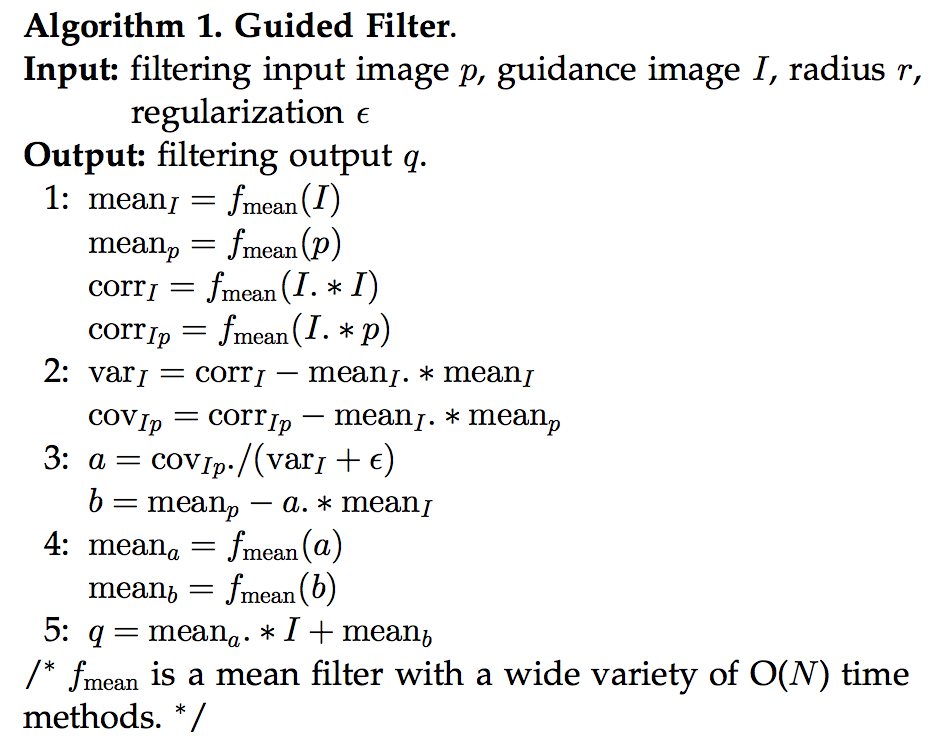

### 以彩色图做指导滤波

上面的结果，图像对应位置相乘，都是单通道的情况，指导图为单通道，如果要用彩色图像为指导图，则

略微复杂一点，可参考论文公式 13-16

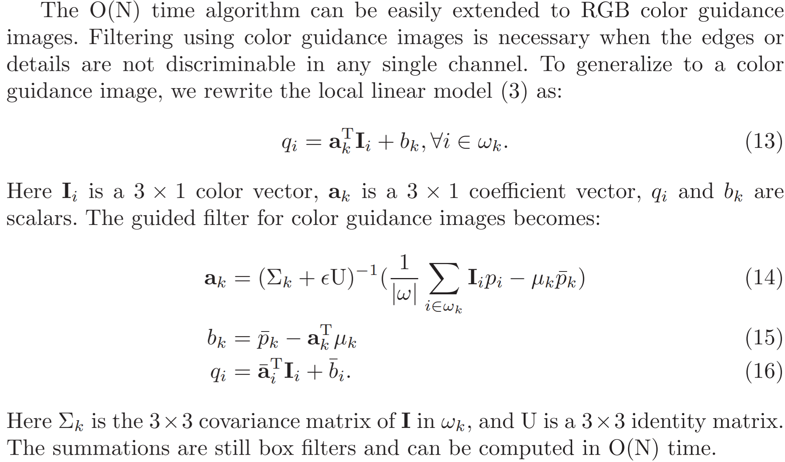

## 复杂度分析

1. 时间复杂度，当均值滤波器使用的是 box filter 加速，整个算法的时间复杂度是 $O(M \times N)$ ，一直都是整个图像对应位置的计算。

## 优点和缺点

**优点**

1. 时间复杂度低。
2. 功能多样，不仅仅局限于去噪平滑。
3. 和双边滤波相比，可以避免梯度反转的现象，看后面的细节增强实验。

# 实现细节

代码：[我的github](https://github.com/hermosayhl/image_processing) （最近在学习图像处理基础知识，会逐渐更新，如果实现有错误，还望指正）

**OpenCV**

具体实现时，我把所有数据都转成了 `double`，方便计算，而不是 `uchar`，所以那些矩阵操作都变成了 for 循环赋值，但因为是一维数组做加减乘除，所以速度并不慢。一开始做的时候，OpenCV，double 图像的存储形式我不大懂，所以掉坑里了，`.step` 竟然不等于宽，坑爹，还是 double 方便。但存储上肯定比 `uchar`，`unsigned char` 要大得多，没办法。

**Box filter**

在引导滤波中，有一个操作很频繁，那就是局部区域取 $mean$ 的操作，如果按照正常的操作，时间复杂度高达 $O(M \times N \times h \times w)$，其中 $h,w$ 分别是滤波核窗口的高和宽，代价高昂。

这种求局部区域之和的，有点像动态规划里的前缀和、区间和这种，用树状数组或者线段树什么的求解。但图像中的局部区域不是连续存储的，所以没法，得重新考虑，我一开始想到的是积分图，在 adaboosting 人脸检测中的一个

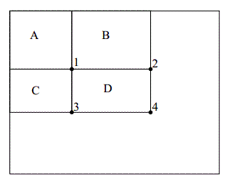

从原点到 4 的面积 + 原点到 1 的面积 - 原点到 2 的面积 - 原点到 3 的面积，就是局部区域 $D$ 的和，做 4 次取和 3 次加减运算，首先需要初始化，求出图中，每一个点和原点构成的矩形内部元素之和。

但还有一个更快的算法—— box filter

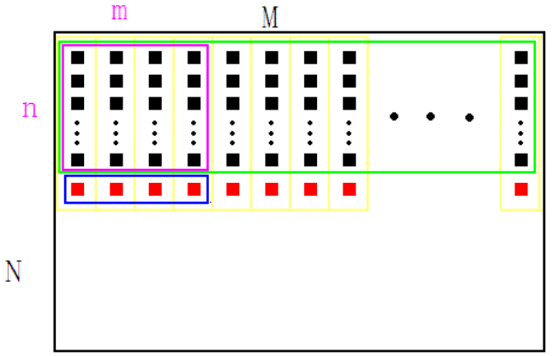

紫色框：滤波核窗口

绿色框：当前这一行的待滤波区域

红色块：buffer，存储 M 列的前 n 行的和

蓝色框：当前滤波核占据的 buffer 

运作原理：

1. 算好红色块，buffer 的值。
2. 算紫色区域的和，只需要蓝色区域的 buffer 加起来即可，很快。
3. 紫色区域往右边走，继续算紫色区域的和，有很多红色块是重复的，只需要去掉最左边的值，加上即将右边 + 1的值，就是当前紫色区域的和。
4. 重复 3 直到这一行结束，到 5。
5. 绿色区域往下走，有很多重复的黑色块，此时只需要去掉最上面的值，加上即将下面 + 1 的值，就可以更新 buffer，然后继续运行 2 - 4。

可以发现，这里面没有重复计算，尽可能地利用了已经计算好的值，根本原理就是空间换时间。

实际实现的时候，还考虑到了 padding 的问题，也就是四个顶角的局部均值计算的问题，这样可以避免四个顶角结果偏暗，具体可以看代码，看一遍就懂。

**以彩色图为参考图的引导滤波**

里面有一个求矩阵的逆的过程，网上好多都是用的 OpenCV 内置的矩阵求逆。。。好慢啊，而且对数据的存储格式还有要求，和我用的 double 数据类型不同，所以我用的是 Eigen3 矩阵运算库，挺快的，而且数据存储格式简单。

# 去噪实验

首先说下，为什么引导滤波可以去噪，我们在前面推导得到的
$$
\begin{aligned}
O_i &= \sum_{k:\,i\in w_k}{(a_k \cdot G_i + b_k)} \\
a_k &=  \frac{Cov(G, I)^{w_k}}{Var(G)^{w_k} + \epsilon} \\
b_k &= mean(I)^{w_k} - a_k \cdot mean(G)^{w_k}
\end{aligned}
$$
当 $\epsilon$ 不等于 0，引导图像 $G$ 就是 $I$ 自身，有
$$
\begin{aligned}
a_k &=  \frac{Var(I)^{w_k}}{Var(I)^{w_k} + \epsilon} \\
b_k &= (1 - a_k) \cdot mean(I)^{w_k} 
\end{aligned}
$$
对于 $k$ 为中心的局部区域（滤波窗口），如果该局部区域是

- 平坦区域，则方差 $Var(I)^{w_k}$ → 0， $a_k$ → 0，$b_k$ → $mean(I)^{w_k}$，此时 $O_i $ →$ \sum_{k:\,i\in w_k}{mean(I)^{w_k}}$，滤波输出→均值滤波
- 边缘等梯度剧烈变化区域，则 $a_k$ → 1，$b_k$ → 0，此时 $O_i $ →$ \sum_{k:\,i\in w_k}{G_i}$，滤波输出→引导图本身，梯度保留

所以说，引导滤波具有保边平滑的效果，推到这里，我只想说，真的牛逼。

1. 去噪前后对比

   虽然保边效果不是很好，但是看得出来，边缘还是得到一定程度保留的，不像高斯滤波那样全部模糊了。

   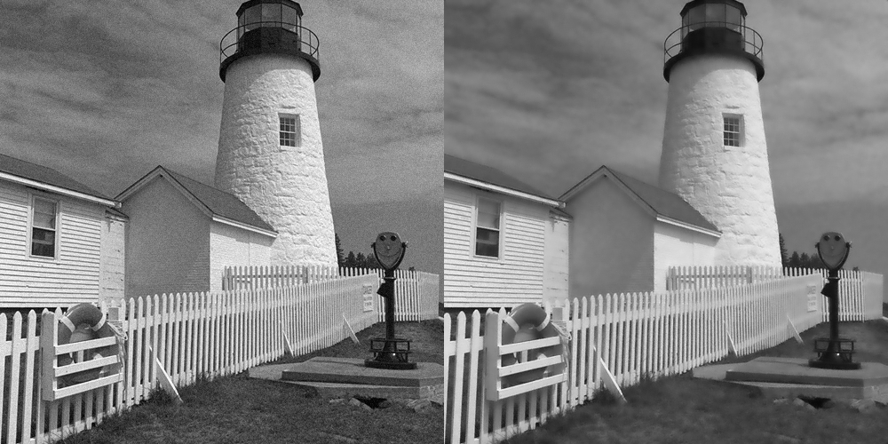

   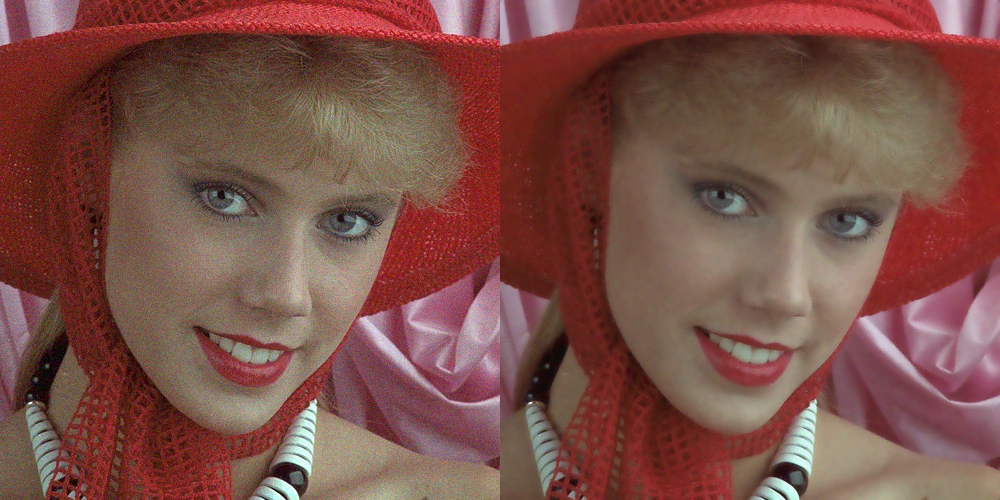

2. 滤波核大小的影响

   滤波核大小，直接涉及到了均值滤波核大小，所以，滤波核越大，周围像素的影响更大，平滑越明显

   

3. $\epsilon$ 的影响
   $$
   \begin{aligned}
   O_i &= \sum_{k:\,i\in w_k}{(a_k \cdot G_i + b_k)} \\
   a_k &=  \frac{Cov(G, I)^{w_k}}{Var(G)^{w_k} + \epsilon} \\
   b_k &= mean(I)^{w_k} - a_k \cdot mean(G)^{w_k}
   \end{aligned}
   $$
   这里有一个变量控制 $a_k$ 的取值，随着 $\epsilon\uparrow$ 增大，$a_k \downarrow$ 减小，$b_k \uparrow$ 增大，也就是说越接近于 $I$ 在 $w_k$ 窗口内的均值滤波，平滑越明显。

   

# 细节增强实验

从左到右分别是：原图 <------> guided filter  <------> bilateral filter

这就是所谓的边缘伪影和梯度反转现象。。。。我之前一直以为是平滑去噪会出现梯度反转，原来是细节增强，看来还是得看原论文才行。

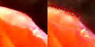

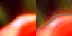

梯度反转。。。why ?

原图 $I$  ，引导图 $G$  ，滤波输出 $O$

细节增强： $\hat{O} = (I - O) \times \lambda + O, \quad \lambda=5$

梯度反转。。。why ?

在这里引导滤波的引导图 $G$ 就是输入图 $I$ 本身，又根据 **滤波输出是引导图像的局部线性变换**，
$$
O_{i} = a_k \cdot G_{i} + b_k, \quad i \in w_k 
$$
给定窗口 $w_k$  ，
$$
\begin{aligned}
\hat{O}^{w_k} &= (I^{w_k} - O^{w_k}) \times \lambda + O^{w_k}  \\
&= (G^{w_k} - O^{w_k}) \times \lambda + O^{w_k} \\
&= (G^{w_k} - (a_k \cdot G^{w_k} + b_k)) \times \lambda + a_k \cdot  G^{w_k} + b_k \\
&= (1 + a_k - \lambda a_k)\cdot G^{w_k}+ (1 - \lambda)b_k
\end{aligned}
$$
可见，细节增强之后的 $\hat{O}$  和引导图 $G$  在局部窗口 $w_k$  内呈线性关系，因此梯度也线性相关，因此，细节增强之后不会出现梯度反转的结果。

但双边滤波没有局部线性变换的假设，因此可能出现局部的梯度反转。

# 抠图实验

从左到右分别是 mask  <------>  彩色指导图（被我 gray 了，实际是彩色） <------>  彩色图做指导的滤波结果  <------>  灰度图做指导的滤波结果

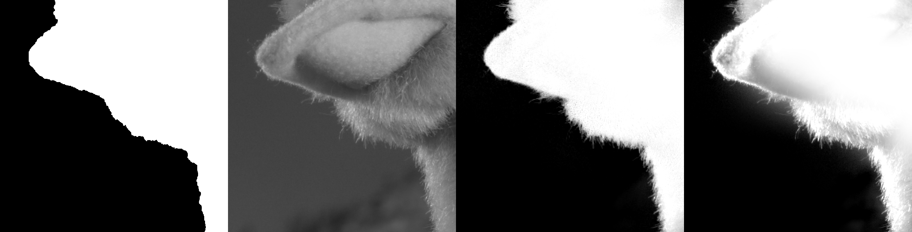

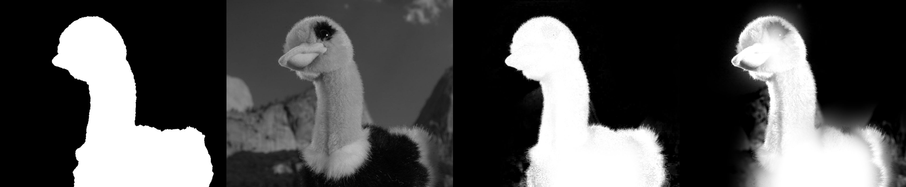

这个鸵鸟的跟论文结果不太一样，图片我从 pdf 上截取的。而且用灰度图做引导滤波的结果有点怪，也可能是我做错了。

叹为观止，我是第一次接触抠图的东西，之前看网上的扣头发丝，我觉得好离谱，比过拟合还离谱，结果做到这里，发现还是我 too young，先求一个粗糙的分割结果，然后用原图做一遍引导滤波，

# Flash 去噪实验

从左到右分别是 noflash  <------>  flash <------>  滤波结果

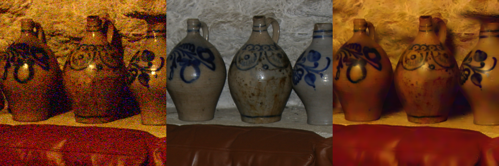

# 参考资料

1. He, Kaiming, Jian Sun, and Xiaoou Tang. "Guided image filtering." *IEEE transactions on pattern analysis and machine intelligence* 35.6 (2012): 1397-1409.
2. 原理参考  https://blog.csdn.net/weixin_43194305/article/details/88959183
3. box filter 代码参考  https://www.cnblogs.com/lwl2015/p/4460711.html
4. 积分图实现  https://blog.csdn.net/weixin_40647819/article/details/89740234
5. 以彩色图指导代码参考 https://blog.csdn.net/weixin_40647819/article/details/89763505

