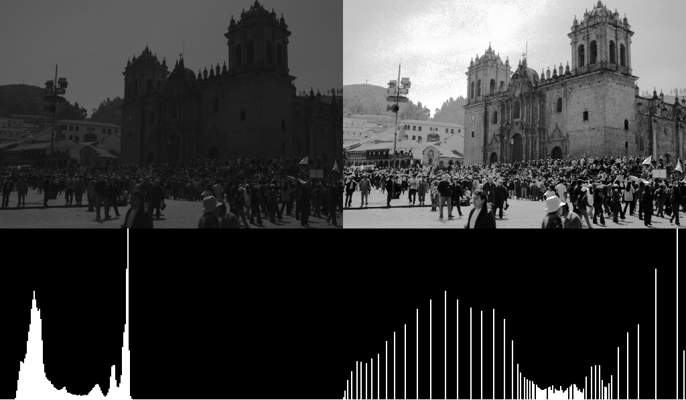
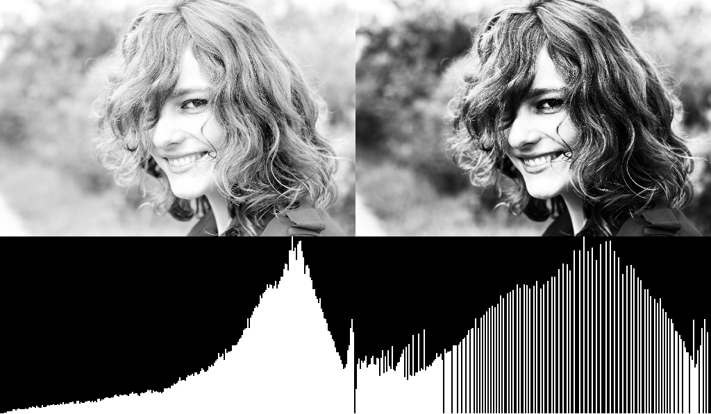
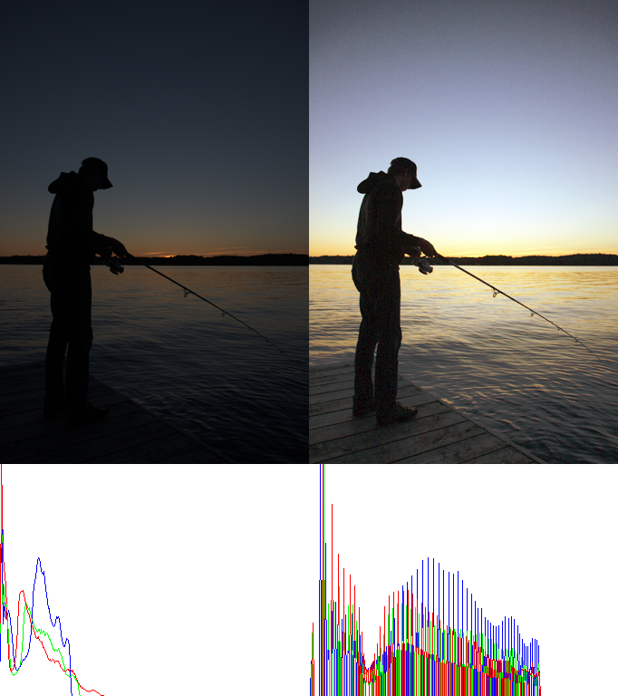
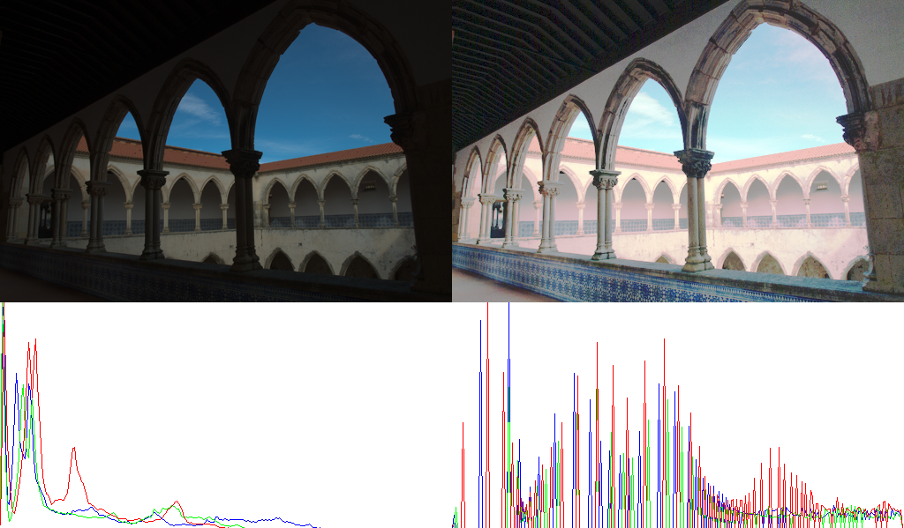

# 原理

直方图均衡可以说是最简单的图像处理之一。

**根本思想** 是把原始图像直方图中集中于某个灰度区间，转变成在全灰度(0-256)范围内的均匀分布。

我理解的是，直方图均衡通过累积概率，对图像的灰度区间进行拉伸（非线性），进而扩大了图像的灰度值范围，所以看起来对比度扩大了。

均匀分布？我第一次看到的时候，很迷惑，代码实现了之后得到的直方图也不是均匀分布，不理解，应该是近似均匀分布。

原理我是看的 [这个博客](https://www.cnblogs.com/tianyalu/p/5687782.html)。

很巧妙，频率累积函数是递增的，所以这也保证了均衡化后的图像 ，对比度能保持，不会出现逆梯度等等；同时经过直方图均衡化的图像再次进行直方图均衡化，图片不变。

虽然简单，但效果一般，会出现很奇怪的结果。一个很大的缺点，一些灰度会消失，从计算过程来看，算频率，除以像素总数，得到“概率”，这个概率 x 255 之后，可能还不到 1，凑不齐一个灰度，直接被 floor 吞掉了，所以说灰度级可能会减少。

# 结果

**灰度图**

图像对比度较低，像素集中在较低的灰度值，经过直方图均衡化之后，很明显对比度增强，同时亮度分布也往低灰度迁移，但也引入了很大的噪声（天空），不仅如此，看灰度直方图，稀疏了不少。。。。

即使是过曝的图像，也可以做一定的校正；看起来这么满的直方图分布，均衡化之后，空了好多。。。

**彩色图像**

缺乏曝光的图像，对比度也容易较低，比如，我们能清楚看到一些细节，虽然直接乘以一个数也能得到，哈哈

但是也不是所有彩色图像都适合

这张带有走廊和天空的图片，阴影部分过曝，而天空灰蒙蒙的，挺失败的，目前我尚未看出原因来。

那直方图均衡到底适合什么样的图像呢？

# 参考

1. 看这一篇就够了 https://www.cnblogs.com/tianyalu/p/5687782.html

