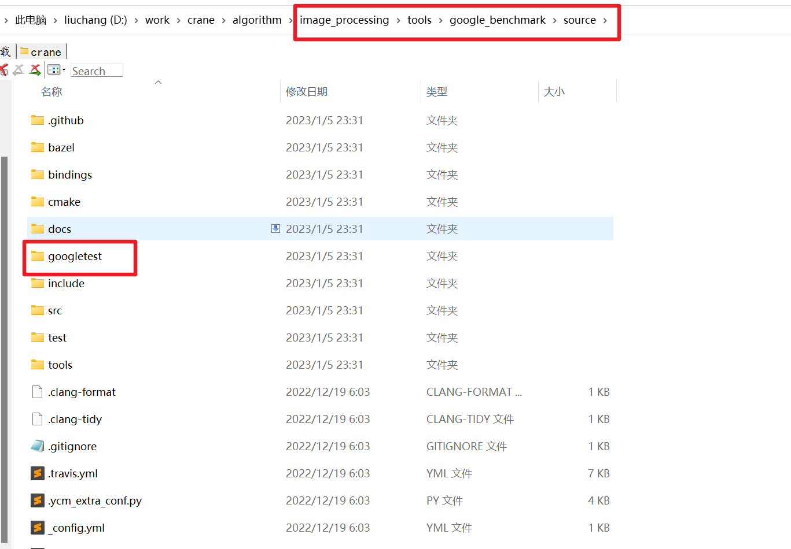
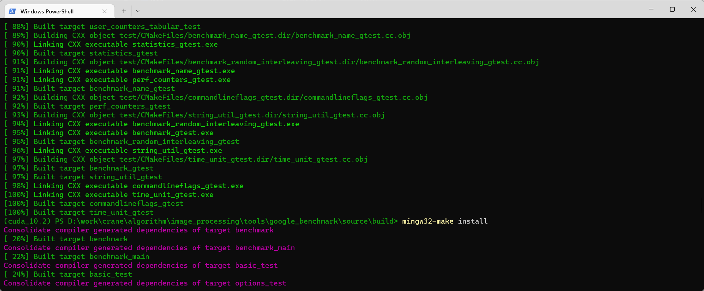
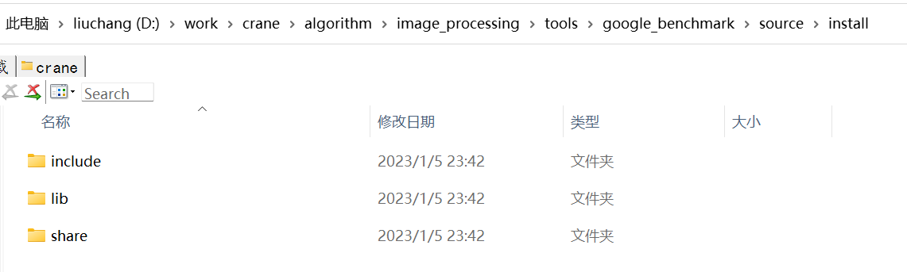

分别从 github 下载 [benchmark](https://github.com/google/benchmark) 和 [googletest](https://github.com/google/googletest)，按照如下位置放置



在当前目录建立目录 build

```shell
mkdir -p build
cd build
```

输入 CMake 指令，生成 Makefile，

```shell
cmake .. -G "MinGW Makefiles" -DCMAKE_BUILD_TYPE=Release -DCMAKE_INSTALL_PREFIX="../install"
```

因为我的 C++ 环境是 TDM GCC-10.3，因此需要指定是 "MinGW Makefiles"，如果 make 的话生成的库文件安装在当前目录下的 install

输入 make 指令，编译

```shell
mingw32-make -j4
```

安装 release 的文件

```shell
mingw32-make install
```

我是一次编译就过，



可以看到，在 benchmark 当前目录下的 install 目录



